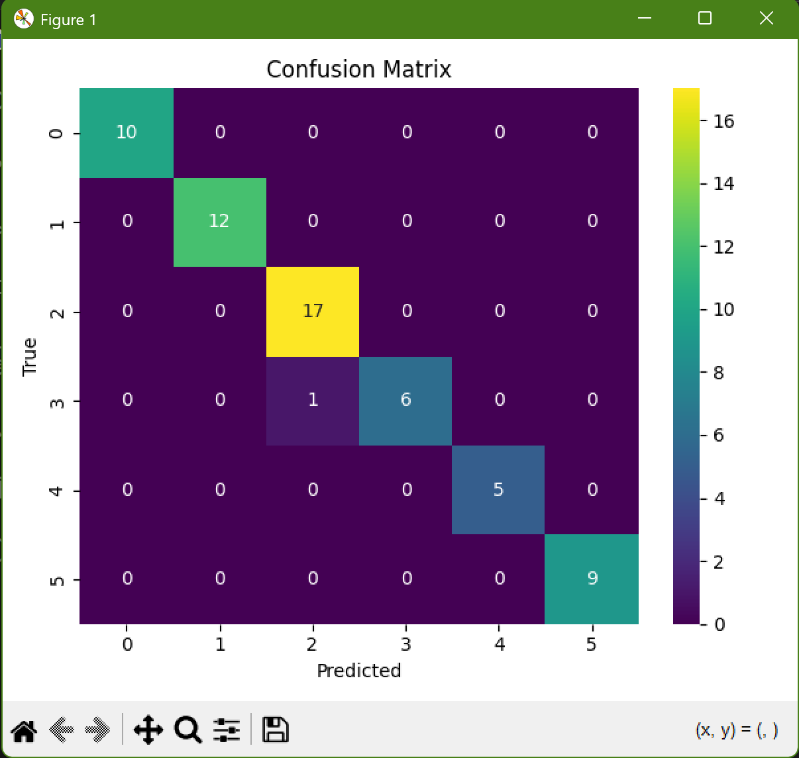
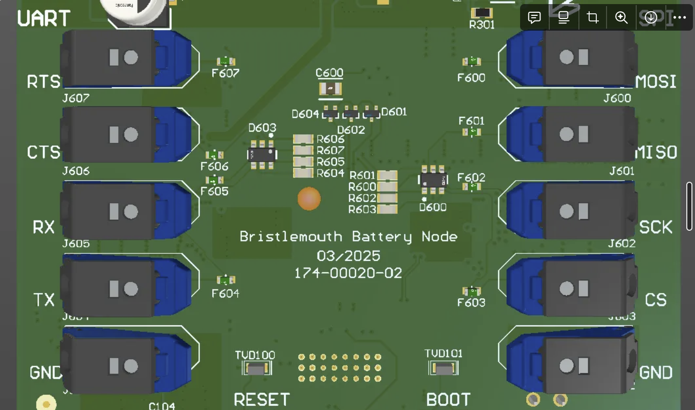
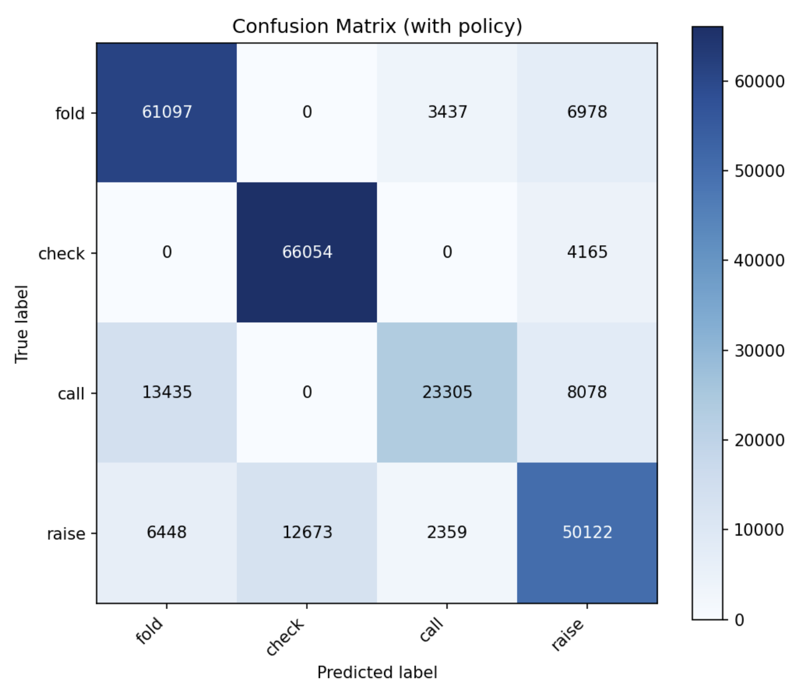
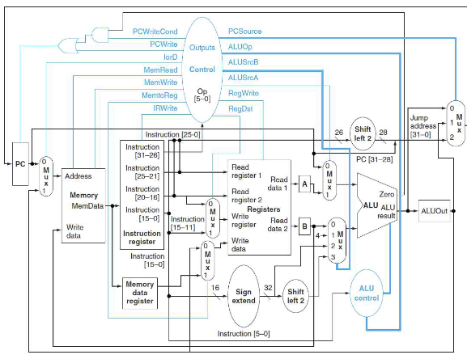

# 👋 Nick LaVine

**`Embedded & Systems Engineer (Python/C++ · Real-Time · UI/UX for Operators)`**

## 📫 Contact & Resume
 &nbsp;&nbsp;&nbsp;&nbsp;&nbsp;&nbsp;
 &nbsp;&nbsp;&nbsp;&nbsp;&nbsp;&nbsp;

I build production-minded systems that connect **hardware** to **operator-ready software**: embedded comms on STM32/Raspberry Pi, real-time control and data pipelines in Python, and UIs that make complex tools usable. Recently: ML/CV for industrial pipeline defect detection with a Python GUI that ingests `.csv/.mat` and renders live 2-D/3-D views; and embedded integrations that push reliable **SPI/UART** data between custom optics and the Bristlemouth dev kit. :contentReference[oaicite:1]{index=1}

  
  

---

### 🔧 Tech I use

 

- **Embedded/Edge:** STM32CubeIDE, ST-Link/Tag-Connect, HAL/LL; UART/SPI/I²C; GPIO/Timers; Raspberry Pi (Linux).
- **ML & Data:** PyTorch/TensorFlow, numpy/pandas; GUI-integrated inference; real-time signal displays.
- **Apps & UI:** PyQt5, Swift/SwiftUI, Kotlin Multiplatform + Jetpack Compose; reproducible build/deploy.
- **Hardware/FPGA:** VHDL/Vivado; custom pipelined CPU & FSM control.

### 🚀 Featured Projects

> Thumbnails live in `/media`. Swap links to public repos or demo videos as you publish them.

  <a href="https://github.com/NAL1618/Pipeline-Defect-Detection">
     
    <b>Pipeline Defect Detection GUI + CNN</b> — Python app that ingests .csv/.mat, renders live 2-D/3-D views, and runs CNN-based defect classification in real time.
  </a>
  &nbsp;&nbsp;&nbsp;
  <a href="https://github.com/NAL1618/Bristlemouth-Optics-Integration">
     
    <b>Bristlemouth ↔ Optical Interrogator Integration</b> — Robust SPI/UART link between custom optics and dev kit; reliable bi-directional transfer for field deployment.
  </a>

  <a href="https://github.com/NAL1618/AI-Poker-Coach">
     
    <b>AI Poker Coach</b> — Team project: MLP trained on hand histories; integrates with CV + MCU subsystems for decision support during gameplay.
  </a>
  &nbsp;&nbsp;&nbsp;
  <a href="https://github.com/NAL1618/KMP-Casino-App">
     
    <b>Kotlin Multiplatform Casino App</b> — Shared backend; Android (Compose) + iOS (Swift/SwiftUI); packaged as XCFramework and deployed to both platforms.
  </a>

  <a href="https://github.com/NAL1618/VHDL-Pipelined-CPU">
     
    <b>Custom Pipelined CPU (VHDL)</b> — Multi-cycle design with six-state FSM; ALU, register file, memory, and branch/memory ops.
  </a>

---

### 🧩 What I’m good at

- **Embedded integration:** bring-up and debug of UART/SPI paths between MCUs and Linux hosts; durable data links for field conditions. :contentReference[oaicite:6]{index=6}
- **Realtime ML + UX:** turn raw signals into actionable displays (2-D/3-D, live plots) and wire models for on-demand inference inside desktop apps. :contentReference[oaicite:7]{index=7}
- **Cross-platform delivery:** Kotlin Multiplatform shared logic, Compose on Android, Swift/SwiftUI on iOS; package as XCFramework. :contentReference[oaicite:8]{index=8}
- **Digital design:** VHDL with FSM control and datapath integration; methodical test/iterate approach. :contentReference[oaicite:9]{index=9}

<!--
Notes for me:
- Thumbnails live in /media to avoid hotlinking private repos.
- If a project must stay private, create a public mirror or a showcase repo with README + screenshots.
-->

<!--
Notes for me:
- Thumbnails live in /media to avoid hotlinking private repos.
- If a project must stay private, create a public mirror or a showcase repo with README + screenshots.
-->
