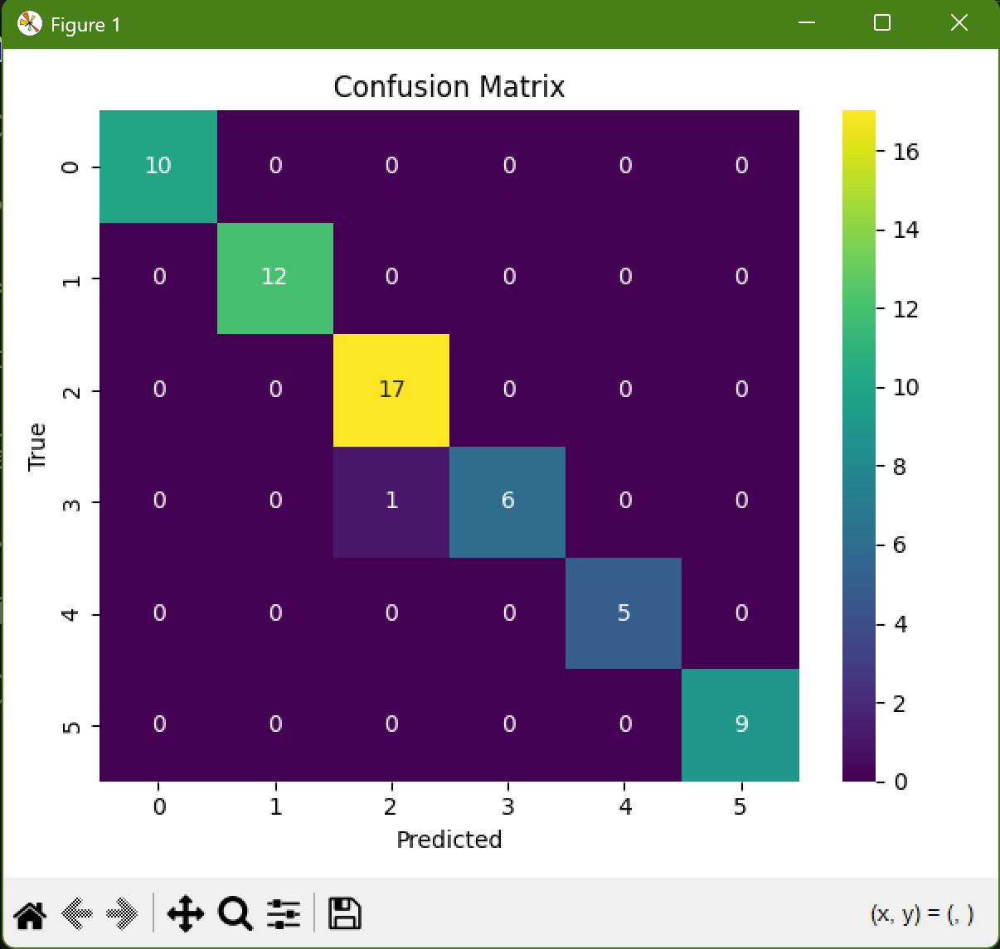
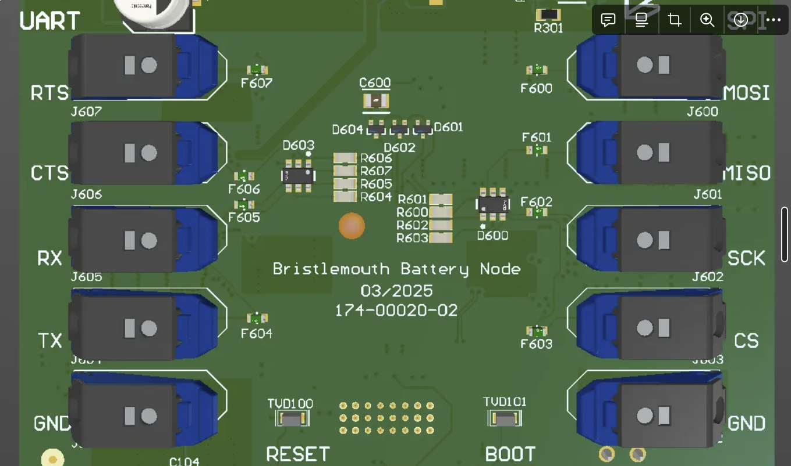
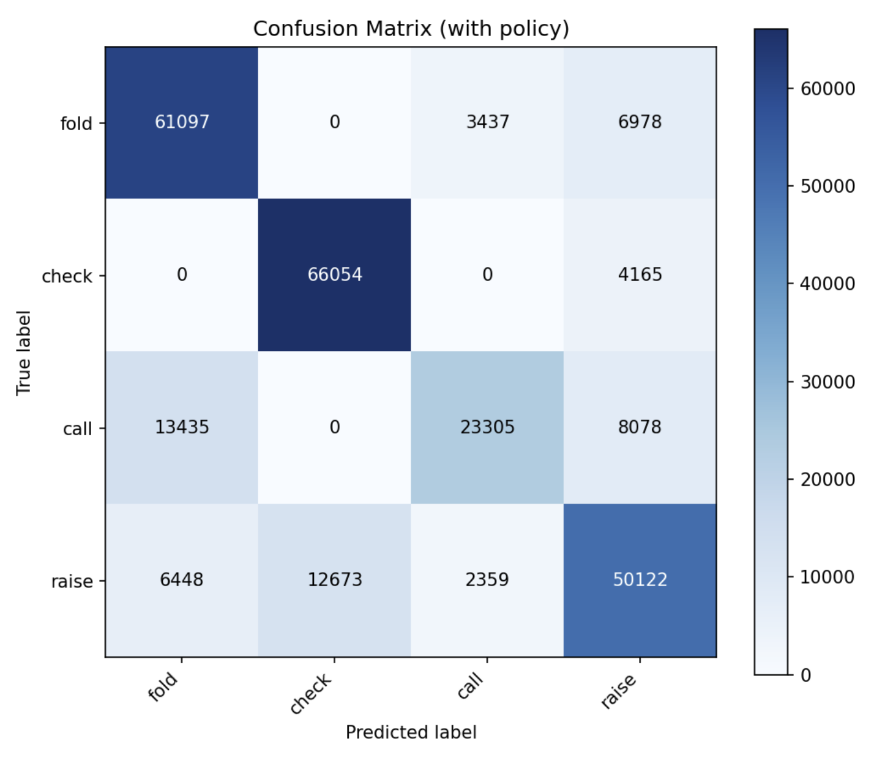
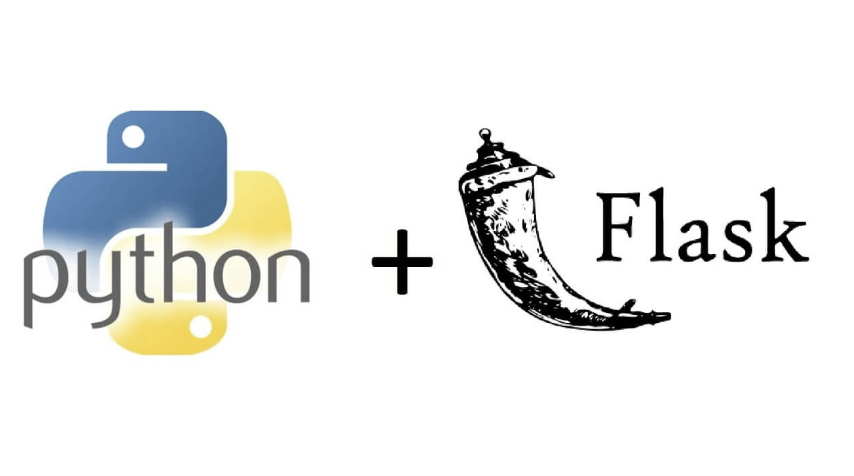
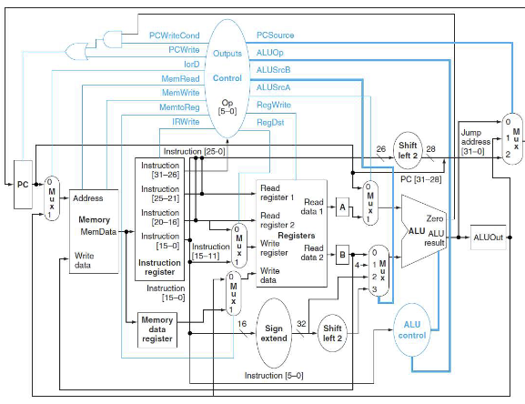
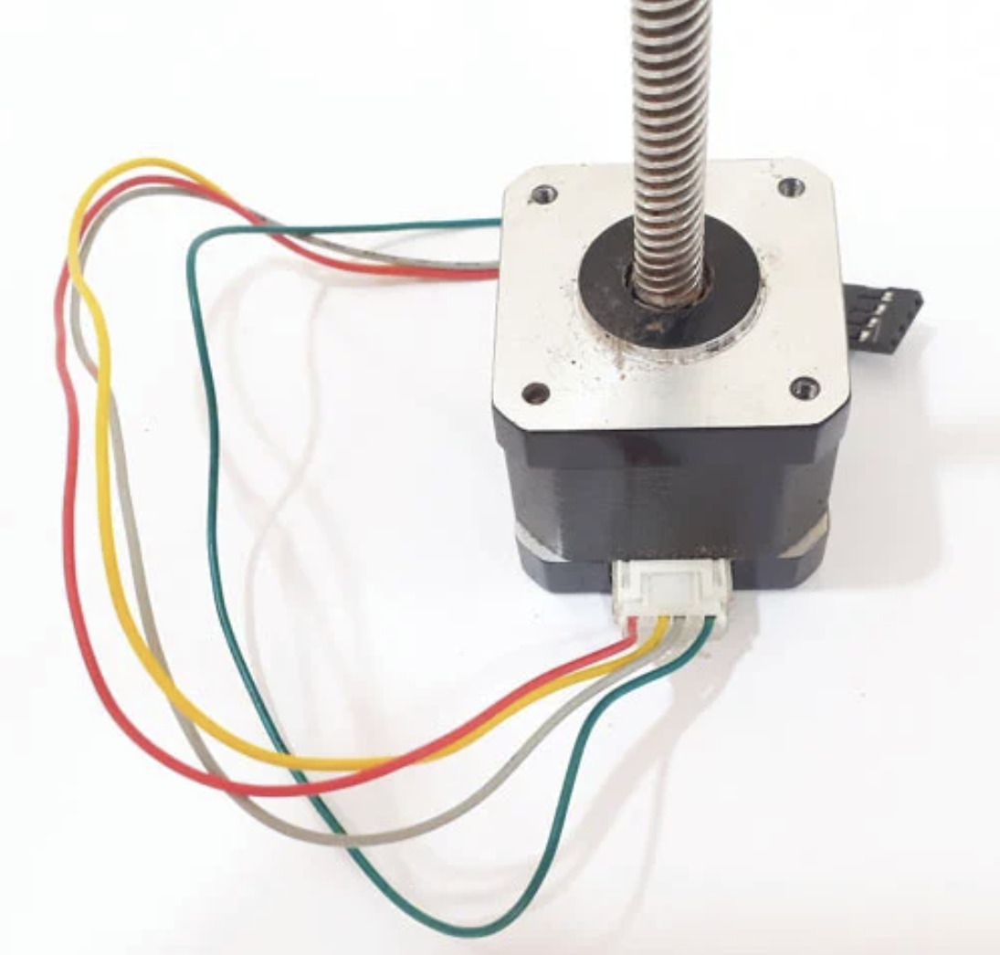

# Nick LaVine

**`Computer Engineer`**

## Contact & Resume

  
  
  

Hello! My name is Nick, and I am a computer engineer with a Bachelor of Science from the University of Pittsburgh. I have experience across several areas of computing, with a strong focus on embedded systems and machine learning. Below are several projects that highlight my technical background and interests across hardware and software.

  
  

---

### Tech I Use

  
  
  
  
  
  
  
  
  
  
  

- **Languages:** Python, C++, C, Kotlin, Swift, SQL, Bash  
- **Embedded & Hardware:** STM32, Arduino, Raspberry Pi, UART, SPI, I²C, GPIO, timers, interrupts, PWM, ADC  
- **Computer Engineering:** VHDL, Vivado, FSMs, pipelined CPU design, datapath/control logic, digital system design  
- **ML & Data Systems:** PyTorch, TensorFlow, NumPy, pandas, scikit-learn, signal processing, live inference workflows  
- **Applications & Interfaces:** PyQt5, Flask, SwiftUI, Jetpack Compose  
- **Development Tools:** Git, GitHub, Linux, MATLAB, VS Code, STM32CubeIDE, debugging, testing, hardware/software integration   VHDL/Vivado; custom pipelined CPU & FSM control.

### Featured Projects

> Thumbnails live in `/media`. Swap links to public repos or demo videos as you publish them.

<table align="center">
  <tr>
    <td align="center" valign="top" width="33%">
      <a href="https://github.com/NAL1618/Pipeline-Defect-Detection">
         
        <b>Pipeline Defect Detection GUI + CNN</b>
      </a>
       
      Python app that ingests .csv/.mat, renders live 2-D/3-D views, and runs CNN-based defect classification in real time.
    </td>
    <td align="center" valign="top" width="33%">
      <a href="https://github.com/NAL1618/Bristlemouth-Optics-Integration">
         
        <b>Bristlemouth ↔ Optical Interrogator Integration</b>
      </a>
       
      Robust SPI/UART link between custom optics and dev kit; reliable bi-directional transfer for field deployment.
    </td>
    <td align="center" valign="top" width="33%">
      <a href="https://github.com/NAL1618/AI-Poker-Coach">
         
        <b>AI Poker Coach</b>
      </a>
       
      Team project: MLP trained on hand histories; integrates with CV + MCU subsystems for decision support during gameplay.
    </td>
  </tr>
  <tr>
    <td align="center" valign="top" width="33%">
      <a href="https://github.com/NAL1618/Search-Engine">
         
        <b>Python Search Engine + AI Response</b>
      </a>
       
      Search engine built on a Wikipedia-based document database with ranking, retrieval, and an AI response layer, served through a Flask front end.
    </td>
    <td align="center" valign="top" width="33%">
      <a href="https://github.com/NAL1618/VHDL-Pipelined-CPU">
         
        <b>Custom Pipelined CPU (VHDL)</b>
      </a>
       
      Multi-cycle design with six-state FSM; ALU, register file, memory, and branch/memory ops.
    </td>
    <td align="center" valign="top" width="33%">
      <a href="https://github.com/NAL1618/Head-Massager-Project">
         
        <b>Smart Head Massager</b>
      </a>
       
      Hardware/software project combining Arduino control, CAD-designed mechanical components, and a Swift-based interface to coordinate the system.
    </td>
  </tr>
</table>

---
